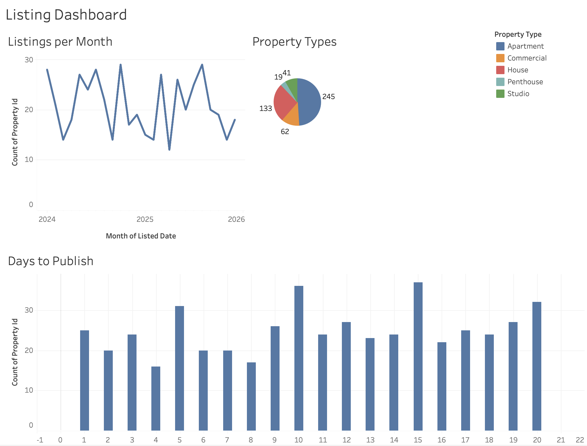
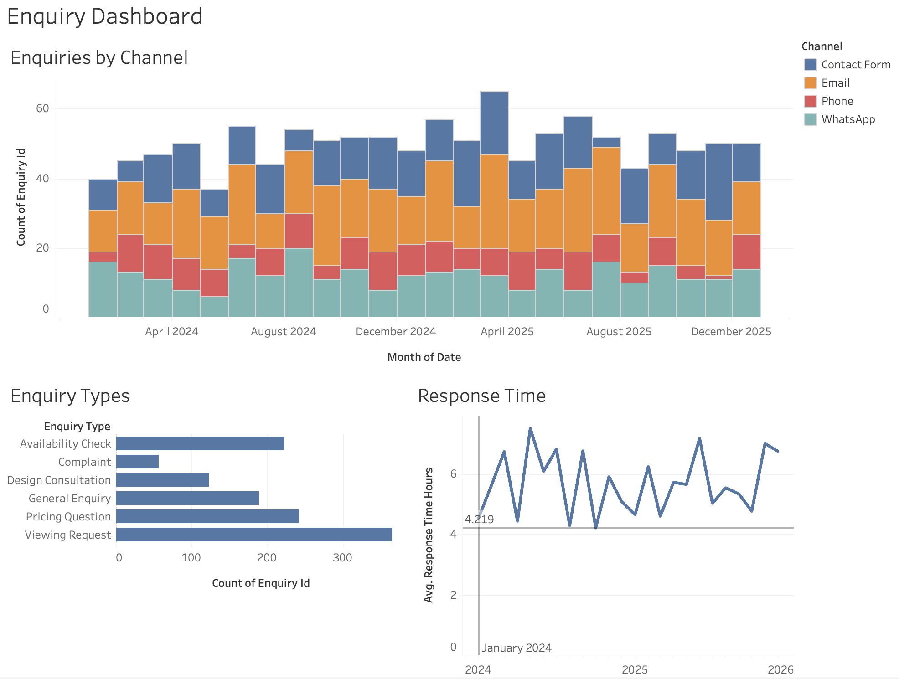

# Dashboard Documentation — RaumKraft BI Dashboard (Tableau)

## Purpose

This Tableau dashboard is the **communication layer** for the Chleo meeting. It shows what data-driven insights RaumKraft could gain from their existing data, and frames the AI use cases in a business context. It is not a production analytics tool — it is a stakeholder presentation piece.

## Metrics (7 Stakeholder-Relevant KPIs)

| # | Metric | Why it matters to Chleo | Data source |
|---|---|---|---|
| 1 | **Listings published per month** (trend) | Baseline for measuring AI-assisted listing speed improvement | `properties.csv` |
| 2 | **Average time-to-publish** (days from intake to live listing) | Directly tied to Use Case 1 value proposition | `properties.csv` |
| 3 | **Enquiry volume by channel** (email, form, WhatsApp, phone) | Shows the triage workload — justifies Use Case 2 | `enquiries.csv` |
| 4 | **Average first-response time** (hours) | The metric Use Case 2 aims to improve; benchmark is <2 hours | `enquiries.csv` |
| 5 | **Revenue by service line** (brokerage vs. design vs. management) | Contextualises the business; shows where AI impact lands | `revenue_monthly.csv` |
| 6 | **Design project pipeline** (active / pending / completed) | Frames Use Case 3; shows capacity constraints in design team | `projects.csv` |
| 7 | **Agent productivity distribution** (listings per agent, response time variance) | Highlights inconsistency that AI standardisation can address | `agents.csv` |

## Dashboard Layout (4 Sheets / Tabs)

### Tab 1: Business Overview
- Revenue by service line — **bar chart** (dimension: `service_line`, measure: `SUM(revenue_eur)`, colour by service line)
- Listings published per month — **line chart** (dimension: `MONTH(listed_date)`, measure: `COUNT(property_id)`)
- Active design projects — **KPI card** (filtered to `status = "Active"`, `COUNT(project_id)`)
- Total enquiries this quarter — **KPI card** (`COUNT(enquiry_id)` with date filter)

### Tab 2: Listing Performance
- Time-to-publish distribution — **histogram** (measure: `days_to_publish`, bin size: 2 days)
- Listings by property type — **donut chart** (or treemap — dimension: `property_type`, measure: `COUNT`)
- Agent productivity comparison — **horizontal bar chart** (dimension: `agent_id`, measure: `AVG(days_to_publish)`, sorted ascending)
- Monthly trend overlay — **dual-axis line** (month on x, count of listings + avg days-to-publish)

### Tab 3: Client Enquiry Analysis
- Enquiry volume by channel — **stacked bar** (dimension: `MONTH(date)`, colour: `channel`)
- Average response time by agent — **bar chart** (dimension: `agent_id`, measure: `AVG(response_time_hours)`, reference line at 2h target)
- Enquiry classification breakdown — **pie chart** or **treemap** (dimension: `enquiry_type`)
- Response time trend — **line chart** (dimension: `MONTH(date)`, measure: `AVG(response_time_hours)`)

### Tab 4: AI Opportunity Indicators
- Estimated time saved per listing with AI assist — **calculated field KPI card** (`COUNT * 0.5` hours saved at 30 min each)
- Enquiry types eligible for auto-drafting — **% of total bar** (filter: `enquiry_type IN ("Viewing Request", "Pricing Question", "Availability Check")`)
- Design brief generation potential — **KPI card** based on `SUM(brief_hours)` from `projects.csv`
- What-if parameter: **parameter slider** — "If response time drops to X hours, how many more leads convert?" (use a Tableau parameter + calculated field)

## How to Build in Tableau

### Step 1: Connect Data
1. Open Tableau Desktop or Tableau Public
2. Connect → Text File → select each CSV from `data/`
3. Create relationships:
   - `properties.csv` ↔ `enquiries.csv` on `property_id`
   - `properties.csv` ↔ `agents.csv` on `agent_id`
   - `revenue_monthly.csv` as standalone (no join needed)
   - `projects.csv` as standalone

### Step 2: Create Calculated Fields
```
// Time saved estimate (hours)
[Time Saved Hours] = [Number of Records] * 0.5

// Auto-draftable enquiry flag
[Auto Draftable] = IF [enquiry_type] IN ("Viewing Request", "Pricing Question", "Availability Check") THEN "Yes" ELSE "No" END

// Response time target met
[Meets Target] = IF [response_time_hours] <= 2 THEN "Yes" ELSE "No" END
```

### Step 3: Build Each Tab
Create a new worksheet per chart, then combine into dashboards (one dashboard per tab). Use dashboard size: **Automatic** or **Fixed: 1200×800**.

### Step 4: Formatting
- **Colour palette:** Use a custom palette — navy (`#065A82`), teal (`#1C7293`), midnight (`#21295C`), success green (`#059669`), warning amber (`#D97706`)
- **Font:** Tableau Book or Calibri for consistency with the presentation
- **Tooltips:** Customise to show business-relevant context, not just raw numbers
- **Reference lines:** Add 2-hour target line on response time charts

### Step 5: Export
- Save as `.twbx` (packaged workbook — includes data) to `dashboard/dashboard.twbx`
- If using Tableau Public: publish and include the public URL in this doc

## Data Sources

All data is **synthetic**, generated to match realistic distributions for a 150-person German real estate and interior design firm. See `data/` folder for CSV files.

| File | Description | Rows (approx.) |
|---|---|---|
| `properties.csv` | Property listings with dates, types, prices, agents | ~500 |
| `enquiries.csv` | Client enquiries with timestamps, channels, response times | ~1,200 |
| `projects.csv` | Interior design projects with status, timelines, budgets | ~80 |
| `agents.csv` | Agent-level summary (anonymised) | ~50 |
| `revenue_monthly.csv` | Monthly revenue by service line | ~72 |

## How to Open

**Option A — Tableau Desktop** (if you have a licence):
1. Open Tableau Desktop
2. Open `dashboard.twbx`

**Option B — Tableau Public** (free):
1. Download Tableau Public from https://public.tableau.com
2. Open the `.twbx` file, or connect to the CSVs directly
3. Publish to your Tableau Public profile for sharing

## Screenshots

**Listing Dashboard** — Listings per Month, Property Types, Days to Publish


**Enquiry Dashboard** — Enquiries by Channel, Enquiry Types, Response Time


- [ ] Tab 1: Business Overview
- [ ] Tab 2: Listing Performance
- [ ] Tab 3: Client Enquiry Analysis
- [ ] Tab 4: AI Opportunity Indicators

## Design Decisions

- **Colour palette:** Matches the presentation deck (ocean blues + accent colours) for a cohesive pitch
- **No jargon:** Metrics labelled in business language, not technical/AI language
- **Interactivity:** Filters for date range and property type; highlight actions between charts
- **Narrative flow:** The dashboard builds from "here's your business" → "here's where time is lost" → "here's what AI could change"
